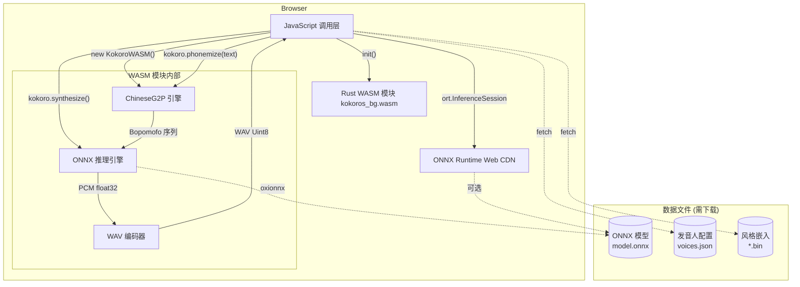
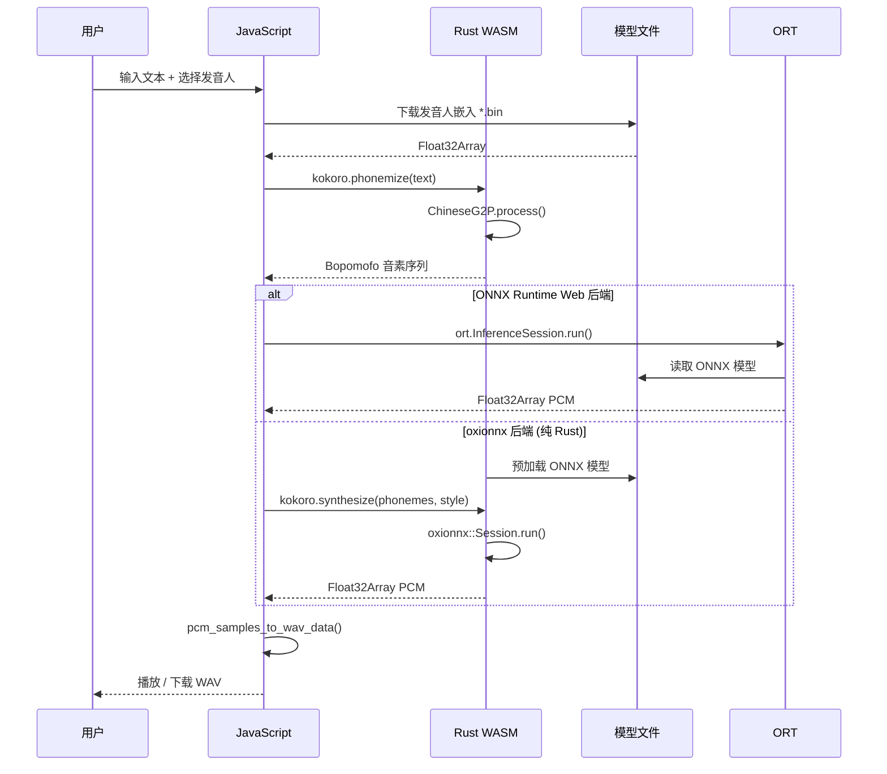
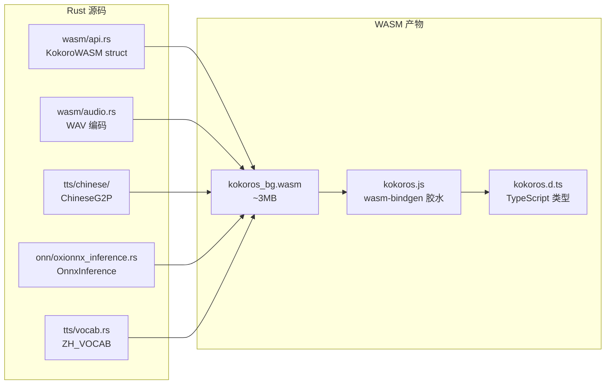
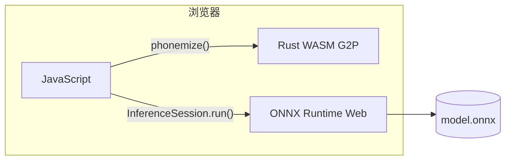
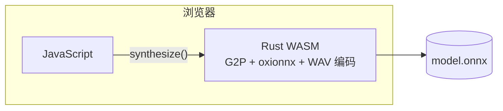

# Kokoro TTS WASM — 浏览器端语音合成

## 概述

Kokoro TTS 的 WASM（WebAssembly）模块将核心 TTS 引擎编译为 `wasm32-unknown-unknown` 目标，使得**高质量中文语音合成可以直接在浏览器中运行**，无需后端服务器。用户的文本数据始终保留在本地，推理完全在浏览器沙箱内完成。

WASM 模块包含两个核心能力：

- **G2P（字素转音素）引擎** — 将中文文本转换为 Bopomofo（注音符号）音素序列（含多音字消歧 + 变调处理）
- **音素 Tokenization** — 使用 `ZH_VOCAB` 词表进行字符级 tokenization
- **ONNX 推理引擎** — 将音素序列 + 语音风格嵌入 → PCM 音频采样

支持两种推理后端：

| 后端 | Demo 页面 | 特点 |
|------|-----------|------|
| **ONNX Runtime Web** | `wasm_demo.html`, `browser_demo.html` | 微软官方 ONNX Runtime 的 WebAssembly 端口，功能完整 |
| **oxionnx（纯 Rust）** | `rust_wasm_demo.html` | 纯 Rust ONNX 推理引擎，与 WASM 编译目标深度整合 |

---

## 系统架构

### 模块总览



### 数据流



### 编译产物



---

## JavaScript API 参考

### 初始化

```javascript
import init, { KokoroWASM, pcm_samples_to_wav_data } from './wasm-pkg/kokoros.js';

// 1. 初始化 WASM 运行时
await init();

// 2. 创建 KokoroWASM 实例
const kokoro = new KokoroWASM({
    usePolyphonic: true  // 启用多音字消歧（默认 true）
});
```

### KokoroWASM 方法

| 方法 | 参数 | 返回值 | 说明 |
|------|------|--------|------|
| `constructor(config)` | `{ usePolyphonic?: boolean }` | `KokoroWASM` | 创建实例 |
| `phonemize(text, lang?)` | `text: string`, `lang?: string` | `Promise<string>` | 中文文本 → Bopomofo 音素（IPA 模式） |
| `phonemizeIPA(text, lang?)` | `text: string`, `lang?: string` | `Promise<string>` | 中文文本 → IPA 音素 |
| `phonemizeBopomofo(text, lang?)` | `text: string`, `lang?: string` | `Promise<string>` | 中文文本 → Bopomofo 注音（v1.1-zh 模式） |
| `phonemizeDisplay(text, lang?)` | `text: string`, `lang?: string` | `Promise<string>` | 中文文本 → 可读注音 |
| `tokenize(phonemes, lang?)` | `phonemes: string`, `lang?: string` | `Promise<Uint32Array>` | 音素 → token ID 数组（MODEL_VOCAB） |
| `tokenizeV11(phonemes)` | `phonemes: string` | `Promise<Uint32Array>` | 音素 → token ID 数组（ZH_VOCAB，v1.1-zh 模型用） |
| `loadModel(bytes)` | `bytes: Uint8Array` | `Promise<void>` | 加载 ONNX 模型（oxionnx） |
| `isModelLoaded()` | — | `boolean` | 模型是否已加载 |
| `synthesize(text, style, speed)` | `text: string`, `style: Float32Array`, `speed: number` | `Promise<Object>` | 文本 → 语音（oxionnx，IPA 模式） |
| `synthesizeWithPhonemes(phonemes, style, speed)` | `phonemes: string`, `style: Float32Array`, `speed: number` | `Promise<Float32Array>` | 音素 → 语音（oxionnx） |
| `getVoices()` | — | `Promise<VoiceInfo[]>` | 获取内置发音人列表 |
| `getSampleRate()` | — | `number` | 返回采样率 24000 |

### 辅助函数

| 函数 | 说明 |
|------|------|
| `pcm_samples_to_wav_data(samples)` | Float32Array PCM → WAV 格式 Uint8Array (24000Hz, 16bit mono) |

### TypeScript 类型

```typescript
interface KokoroConfig {
  usePolyphonic?: boolean;       // 是否启用多音字消歧
}

interface VoiceInfo {
  id: string;                    // 发音人 ID (如 "zf_xiaobei")
  name: string;                  // 显示名称
  language: string;              // 语言代码
  gender: 'male' | 'female';    // 性别
}

interface SynthesisResult {
  phonemes: string;              // 生成的音素序列
  phonemesDisplay: string;       // 可读注音
  text: string;                  // 原始文本
  audio: Float32Array;           // PCM 音频数据
  sampleRate: number;            // 采样率 (24000)
}
```

---

## 两种推理模式详解

### 模式一：ONNX Runtime Web（混合架构）



**原理：**
- G2P（文本→音素）运行在 Rust WASM 中（高效、小体积）
- ONNX 模型推理使用微软官方的 `onnxruntime-web` CDN 库，通过其 WebAssembly 后端执行
- 发音人嵌入由 JavaScript 通过 `fetch` 加载并传递给 ONNX Runtime

**对应页面：** `wasm_demo.html`、`browser_demo.html`

**优势：**
- ONNX Runtime Web 是生产级推理引擎，经过广泛测试和优化
- 支持 `graphOptimizationLevel: 'all'` 等高级优化选项
- 更广泛的 ONNX operator 覆盖

**劣势：**
- 需要从 CDN 额外加载 `ort.min.js`（JS 解析 + WASM 二进制）
- 数据传输需要经过 JS 桥接层
- `ort.InferenceSession.create()` 是异步的，模型加载由 JS 管理

**关键代码：**

```javascript
// 加载 ONNX Runtime Web + WASM G2P
import init, { KokoroWASM } from './wasm-pkg/kokoros.js';

// 初始化 WASM G2P
await init();
const g2p = new KokoroWASM({ usePolyphonic: true });

// 创建 ONNX Runtime session
const session = await ort.InferenceSession.create('./models/onnx/model.onnx', {
    executionProviders: ['wasm'],
    graphOptimizationLevel: 'all'
});

// 合成
const phonemes = g2p.phonemize(text);
const feeds = {
    input_ids: new ort.Tensor('int64', tokenIds, [1, tokenIds.length]),
    style: new ort.Tensor('float32', styleData, [1, styleData.length]),
    speed: new ort.Tensor('float32', [speed], [1]),
};
const results = await session.run(feeds);
const audio = results[0].data;
```

### 模式二：纯 Rust WASM + oxionnx（全 Rust 架构）



**原理：**
- G2P、ONNX 推理、WAV 编码全部在 Rust WASM 内完成
- 推理使用 **oxionnx** 纯 Rust ONNX 推理库，无 JavaScript 中间层
- 发音人嵌入由 JavaScript 加载后传入 WASM

**对应页面：** `rust_wasm_demo.html`

**优势：**
- 零 JavaScript 推理中间层，数据传输开销最小
- 整体 WASM 二进制仅 ~3MB（无需加载额外 JS 推理库）
- 纯 Rust 生态，与 WASM 编译目标深度整合
- 无需外部 CDN 依赖，离线可执行

**劣势：**
- oxionnx 相对较新，operator 覆盖范围不如 ONNX Runtime
- 不支持 CUDA/WebGL 等硬件加速后端
- 优化选项较少

**关键代码：**

```javascript
import init, { KokoroWASM, pcm_samples_to_wav_data } from './wasm-pkg/kokoros.js';

// 初始化 WASM 模块（包含 G2P + oxionnx + WAV 编码）
await init();
const kokoro = new KokoroWASM({ usePolyphonic: true });

// 加载模型（传入 Uint8Array）
const response = await fetch('./models/onnx/model.onnx');
const modelBytes = new Uint8Array(await response.arrayBuffer());
kokoro.loadModel(modelBytes);

// 合成（全部在 WASM 内完成）
const result = kokoro.synthesize(text, styleEmbedding, speed);
// result.audio  - Float32Array PCM
// result.phonemes - Bopomofo 音素序列
const wavBytes = pcm_samples_to_wav_data(result.audio);
```

---

## 构建指南

### 前置条件

```bash
# Rust 工具链
rustup target add wasm32-unknown-unknown

# wasm-pack（用于编译和打包 WASM）
cargo install wasm-pack
# 或使用安装脚本：https://rustwasm.github.io/wasm-pack/installer/

# LLVM/Clang（WASM 编译需要）
# 项目使用 LLVM-20，确保 clang 可访问
```

### 构建命令

```bash
# 一键构建（推荐）
./scripts/build_wasm.sh

# 手动构建
wasm-pack build crates/kokoros-core \
    --target web \
    --out-dir ../../static/wasm-pkg \
    -- \
    --features wasm \
    --no-default-features
```

### 构建产出

```
static/wasm-pkg/
├── kokoros_bg.wasm        # WASM 二进制 (~3MB)
├── kokoros_bg.wasm.d.ts   # WASM 二进制类型声明
├── kokoros.js             # wasm-bindgen 胶水代码 (~28KB)
├── kokoros.d.ts           # 公共 API TypeScript 声明
└── package.json           # npm 包描述
```

### Feature 依赖分析

`wasm` feature 启用的依赖链：

```
wasm
├── chinese                          # 中文 G2P、分词
│   ├── jieba-rs                     # CJK 分词词典 (含词典数据)
│   ├── pinyin, chinese-number       # 拼音、数字转换
│   └── regex                        # 正则匹配
├── oxionnx-backend                  # 纯 Rust ONNX 推理
│   ├── oxionnx                      # ONNX 运行时
│   ├── oxionnx-core                 # 核心 Tensor 类型
│   └── oxifft                       # FFT 支持
├── wasm-bindgen                     # Rust ↔ JS 绑定
├── wasm-bindgen-futures             # 异步支持
├── js-sys / web-sys                 # Web API 绑定
│   └── AudioContext/Buffer API      # 音频播放
└── serde-wasm-bindgen               # Serde ↔ JS 序列化
```

> **注意：** jieba-rs 词典数据压缩嵌入在 WASM 二进制中，首次调 `Jieba::new()` 时有数百毫秒解压开销（一次性）。

---

## Demo 页面

项目提供 3 个 WASM 演示页面，均位于 `static/` 目录下：

### 1. wasm_demo.html — ONNX Runtime Web + WASM G2P

```
┌─────────────────────────────────────┐
│  Kokoro TTS - ONNX Runtime Web       │
│  状态: ✅ WASM G2P + 模型已就绪      │
├─────────────────────────────────────┤
│  输入文本: 今天天气真不错            │
│  ┌─────────────────────────────────┐│
│  │ 今天天气真不错                  ││
│  └─────────────────────────────────┘│
│  发音人: [zf_xiaobei ▼]  语速: [1.0]│
│  [ 🔊 合成语音 ]  [ ⬇ 下载 WAV ]   │
├─────────────────────────────────────┤
│  音素: ㄐㄧㄣ ㄊㄧㄢ ㄊㄧㄢ ㄑㄧ ...│
│  采样率: 24000Hz                    │
└─────────────────────────────────────┘
```

- G2P 音素提取：Rust WASM
- 模型推理：ONNX Runtime Web（从 CDN 加载 `ort.min.js`）
- 需要加载外部 CDN

### 2. browser_demo.html — 流式语音合成

- 与 `wasm_demo.html` 使用相同的架构（ORT Web + WASM G2P）
- 专注于流式 SSE 风格的演示
- 展示持续的语音生成体验

### 3. rust_wasm_demo.html — WASM G2P + ONNX Runtime Web

```
┌─────────────────────────────────────┐
│  Kokoro TTS - WASM G2P              │
│  状态: ✅  模型已就绪                │
├─────────────────────────────────────┤
│  模型: [v1.1-zh M (int8) ▼]         │
│  输入文本: 今天天气真不错            │
│  发音人: [zf_001 ▼]  语速: [1.0]   │
│  [ 🔊 合成语音 ]  [ ⬇ 下载 WAV ]   │
├─────────────────────────────────────┤
│  进度: ████████████████ 100%        │
│  推理引擎: ORT Web (WASM)           │
└─────────────────────────────────────┘
```

- G2P 音素提取：Rust WASM（Bopomofo 模式，使用 `phonemizeBopomofo` + `tokenizeV11`）
- 模型推理：ONNX Runtime Web（从 CDN 加载 `ort.min.js`）
- 支持三种 v1.1-zh 模型切换（S int4 / M int8 / L fp32）
- 发音人数据：`.bin` 风格嵌入文件，通过 `fetch` 加载

### 运行 Demo 页

```bash
# 方式一：使用 Python 后端服务器（静态文件 + TTS API）
cd static && python3 server.py --port 8080

# 方式二：任意静态文件服务器
cd static && python3 -m http.server 8080
# 或
cd static && npx serve .
```

打开浏览器访问 `http://localhost:8080/wasm_demo.html`。

---

## 特性与优势

### 隐私安全

与传统云 TTS 服务不同，WASM 版本的所有计算在用户浏览器本地执行：

```
传统云 TTS                   Kokoro WASM
┌────────┐                  ┌────────┐
│ 浏览器  │──文本──→│ 云 API │    │ 浏览器  │━━→ WASM 模块
│        │←──音频──│        │    │        │←━━━ (本地推理)
└────────┘                  └────────┘
  数据离用户设备               数据不出浏览器
  (隐私风险)                  (完全离线)
```

### 与 Native 版本对比

| 维度 | Native (CLI/Server) | WASM |
|------|--------------------|------|
| **运行环境** | Linux/Windows 命令行 | 浏览器（Chromium/Firefox/Safari） |
| **推理后端** | ONNX Runtime (pyke/ort) | ONNX Runtime Web |
| **模型加载** | 文件系统读取 | HTTP fetch + ArrayBuffer |
| **中文 G2P** | Bopomofo 模式（jieba 分词 + 多音字消歧 + 变调） | Bopomofo 模式（同上，词典嵌入 WASM） |
| **词表** | ZH_VOCAB | ZH_VOCAB（tokenizeV11） / MODEL_VOCAB（tokenize） |
| **JSON 序列化** | serde_json | serde-wasm-bindgen |
| **多线程** | crossbeam 线程池 + 并行流水线 | 单线程（WASM 无线程） |
| **音频编码** | WAV (32-bit float) | WAV (32-bit float) |
| **音频后处理** | 振幅阈值静音裁切 | DC 偏移消除 |
| **部署** | 需要服务器/终端 | 无服务器，纯前端 |
| **体积** | 二进制 ~20MB（含 ORT 静态库） | WASM ~1.6MB |
| **使用场景** | 批量处理、API 服务 | 交互式网页、隐私优先应用 |

### 性能特征

- **G2P 处理**：< 1ms / 字符（ChineseG2P 纯 Rust 实现）
- **推理延迟**：与 ONNX 模型大小相关，fp16 模型 ~80MB 加载约 1-3 秒
- **实时率**：受浏览器 WASM 引擎限制，通常为 1-2x 实时（Native 可达 5-10x）
- **内存占用**：~100-200MB（主要来自 ONNX 模型 + 音频缓冲区）

### 浏览器兼容性

| 浏览器 | WASM | oxionnx | ONNX Runtime Web |
|--------|------|---------|------------------|
| Chrome 95+ | ✅ | ✅ | ✅ |
| Firefox 100+ | ✅ | ✅ | ✅ |
| Safari 16+ | ✅ | ✅ | ✅ |
| Edge 95+ | ✅ | ✅ | ✅ |
| Node.js | ✅ | ✅ | ❌（需浏览器环境） |

---

## 局限性与注意事项

### 当前限制

1. **中文分词精度** — WASM 使用 `jieba-rs`（CJK 词典）进行词级别分词，精度与 Native 版本一致。分词词典数据压缩嵌入在 WASM 二进制中（增加约 2.9MB 体积），首次 `Jieba::new()` 调用时会解压词典，约数百毫秒一次性开销。

2. **单线程推理** — WASM 当前不支持 `std::thread`，`crossbeam` 线程池不可用，无法并行处理长文本分片

3. **模型数据需下载** — ONNX 模型文件（~80MB）和发音人嵌入文件（~150MB）需要浏览器通过 `fetch` 下载，首次使用加载时间较长

4. **内存限制** — 浏览器 Tab 页内存通常限制在 2-4GB，大型音频合成需要控制分片大小

5. **音频编码** — 当前仅支持 WAV 格式输出，不支持 MP3/Opus 编码（这些 crate 在 WASM 下不编译）

---

## 数据文件清单

WASM Demo 需要以下数据文件（**不在代码仓库中**，需自行下载）：

```
static/
├── index.html                  # 内置（API 服务器演示，SSE + WAV 下载）
├── wasm_demo.html              # 内置
├── browser_demo.html           # 内置
├── rust_wasm_demo.html         # 内置（支持 v1.1-zh S/M/L 三档模型切换）
├── wasm-pkg/
│   └── ...                     # wasm-pack 构建产物
│
├── models/                     # ⚠️ 需手动下载
│   ├── onnx/
│   │   ├── kokoro-v1.1-zh-s.onnx   # int4 量化（47MB）
│   │   ├── kokoro-v1.1-zh-m.onnx   # int8 量化（79MB）
│   │   └── kokoro-v1.1-zh-l.onnx   # fp32 全精度（311MB）
│   └── voices/
│       ├── voices.json         # 发音人配置
│       ├── zf_001.bin          # 各发音人风格嵌入（510KB 每个）
│       ├── zm_001.bin
│       └── ...                 # 更多 *.bin 文件
```

---

## Feature 配置参考

在 `Cargo.toml` 中 WASM 相关的 feature 配置：

```toml
[features]
wasm = [
    "chinese",                      # 中文 G2P 支持
    "oxionnx-backend",              # 纯 Rust ONNX 推理
    "wasm-bindgen",                 # Rust → JS 绑定
    "wasm-bindgen-futures",         # 异步 WASM 支持
    "js-sys",                       # JavaScript 核心 API
    "web-sys",                      # Web API (AudioContext 等)
    "serde-wasm-bindgen",           # JS ↔ Rust 序列化
]

# oxionnx 后端独立 feature
oxionnx-backend = [
    "oxionnx",
    "oxionnx-core",
    "oxionnx/ndarray",
]
```

构建时使用 `--no-default-features` 确保不引入 `ort` 等 Native 专属依赖。

---

## 未来展望

- **Web Worker 并行推理** — 利用 Web Worker 实现多实例并行，弥补 WASM 无线程支持的限制
- **OPFS 模型缓存** — 利用 Origin Private File System 缓存下载的模型文件，避免重复下载
- **流式合成** — 将 `kokoros-server` 的 SSE 流式方案移植到 WASM，实现边合成边播放
- **WebSocket 混合模式** — 轻量 G2P WASM + 远程推理服务器的混合架构
- **`.d.ts` 同步** — 更新 TypeScript 声明以精确匹配 Rust API
